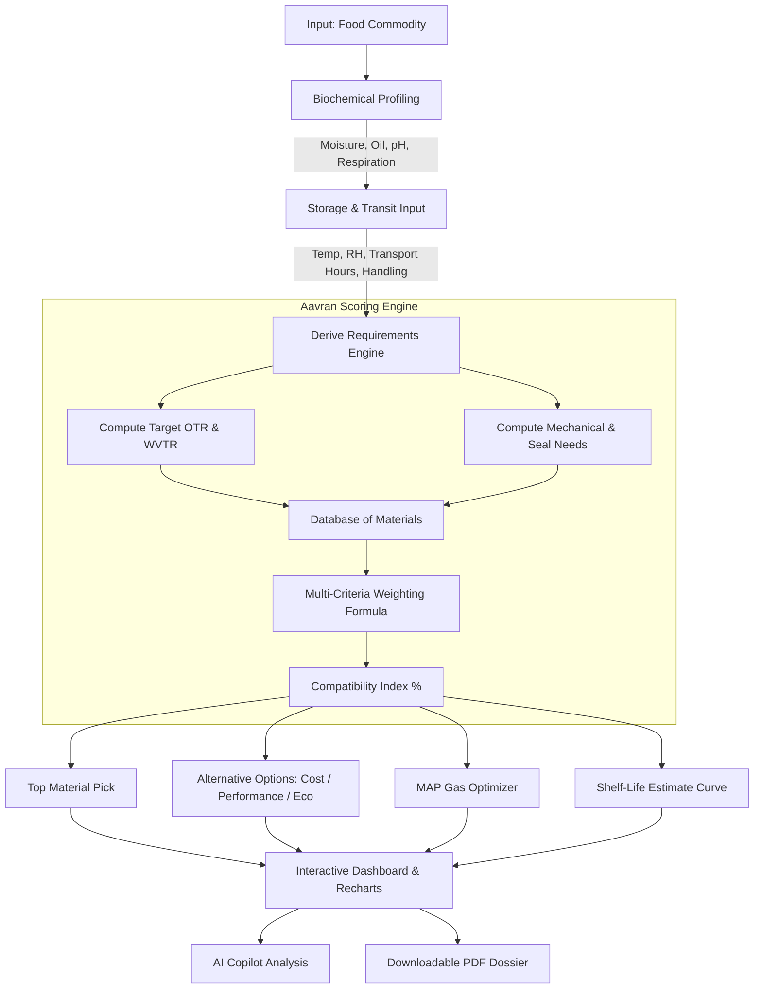

<p align="center">
  <picture>
    <source media="(prefers-color-scheme: dark)" srcset="./logo/logo-transparent-dark.png">
    <source media="(prefers-color-scheme: light)" srcset="./logo/logo-transparent.png">
    
  </picture>
</p>

<h1 align="center">AAVRAN AI · आवरण</h1>

<p align="center">
  <strong>Intelligent Food Packaging Recommendation & Sustainable Decision-Support Engine</strong>
</p>

<p align="center">
  <em>Precision barrier matching, shelf-life modeling, and eco-material intelligence to protect food, reduce spoilage, and minimize environmental impact.</em>
</p>

<p align="center">
  <a href="https://pixel-perfect-render-9133.lovable.app"></a>
  <a href="https://github.com/SyndicateIX/Aavran"></a>
</p>

<p align="center">
  
  
  
  
  
  
  
</p>

---

## 📌 Table of Contents

- [Overview](#-overview)
- [Why Aavran?](#-why-aavran)
- [Key Features](#-key-features)
- [System Architecture & Workflow](#-system-architecture--workflow)
- [Recommendation Engine Logic](#-recommendation-engine-logic)
- [Packaging Materials Catalog](#-packaging-materials-catalog)
- [Tech Stack](#-tech-stack)
- [Getting Started](#-getting-started)
- [Project Structure](#-project-structure)
- [Calculators & Tools](#-calculators--tools)
- [Contributing](#-contributing)
- [License](#-license)

---

## 📖 Overview

**Aavran (आवरण)** is a Sanskrit and Hindi word meaning **"shield"**, **"covering"**, or **"protective envelope"**.

Modern food supply chains face a dual dilemma: **under-packaging** leads to massive food spoilage, pathogen contamination, and economic loss, while **over-packaging** saturates landfills with non-recyclable multi-layer plastics.

**Aavran AI** bridges the gap between food science and packaging engineering. By evaluating the biochemical profile of fresh and processed food commodities alongside storage and transport conditions, Aavran deterministically calculates target barrier specifications (OTR, WVTR, mechanical rigidity, and seal integrity) and matches them to optimal, sustainable materials.

> [!NOTE]
> **Prototype Decision-Support Tool**: All calculations and recommendations provide engineering guidance and rapid prototyping feasibility. Final commercial specifications must always be validated through ASTM/ISO laboratory testing.

---

## 💡 Why Aavran?

| Traditional Packaging Selection | The Aavran AI Approach |
|:--------------------------------|:-----------------------|
| ⚠️ Trial-and-error guesswork or vendor bias | 🎯 **Rule-based multi-factor algorithmic scoring** |
| ⚠️ Neglects respiration and transpiration rates | 🥦 **Dedicated fresh produce respiration & MAP engine** |
| ⚠️ Single-focus (either pure cost or over-engineering) | ⚖️ **Tri-factor trade-off matrix (Cost vs. Performance vs. Eco)** |
| ⚠️ Difficult to compare sustainability lifecycles | 🌿 **LCA indicators: recyclability, complexity, & end-of-life** |
| ⚠️ Scattered data across vendor datasheets | 📑 **Instant automated client-ready technical PDF dossiers** |

---

## ✨ Key Features

### 1. 🍎 Multi-Factor Food Commodity Profiling
- **Biochemical Parameters**: Evaluates moisture percentage (0–100%), fat/oil content, pH acidity, and respiration category.
- **Sensitivity Matrix**: Accounts for sensitivity to oxygen, water vapor, UV/visible light, volatile aroma loss, and microbial degradation.
- **Logistics & Cold Chain Risks**: Incorporates storage temperature (-18°C to +40°C), relative humidity (RH%), transport duration, vibration/handling intensity, and mechanical puncture risks.

### 2. 🛡️ Precision Barrier Matching (OTR & WVTR)
- **OTR (Oxygen Transmission Rate)**: Calculated in $\text{cc}/\text{m}^2/\text{day}$ to curb rancidity and lipid oxidation.
- **WVTR (Water Vapor Transmission Rate)**: Calculated in $\text{g}/\text{m}^2/\text{day}$ to control desiccation or crispness loss.
- **Light & Puncture Shield**: Recommends opacity, foil lamination, or metallization when UV sensitive or under severe mechanical stress.

### 3. 🌬️ Modified Atmosphere Packaging (MAP) Gas Calculator
- Calculates dynamic head-space gas compositions:
  - **Oxygen ($O_2$)**: Kept low (1–10%) to retard respiration without triggering anaerobic fermentation.
  - **Carbon Dioxide ($CO_2$)**: Antimicrobial threshold balancing (3–20%) to inhibit mold and bacterial proliferation.
  - **Nitrogen ($N_2$)**: Inert filler gas balancing headspace volume and preventing package collapse.

### 4. ⚖️ Tri-Focus Material Alternatives
For every analysis, Aavran computes a primary recommendation plus **3 targeted alternatives**:
- 🏷️ **Cost Focused**: Budget-conscious balance for high-volume commercial scaling.
- ⚡ **Performance Focused**: Maximum barrier, robust mechanical defense, and maximum shelf-life.
- 🌱 **Sustainability Focused**: High bio-based content, home/industrial compostability, or mono-material circularity.

### 5. 🤖 Real-Time AI Packaging Advisor
- Streaming copilot powered by the Vercel AI SDK.
- Synthesizes product parameters, regulatory contexts, and transport risks to generate tailored trade-off summaries and compliance notes.

### 6. 💰 Packaging Economics & INR Cost Calculator
- Computes estimated cost per package based on film surface area ($\text{m}^2$), gauge thickness ($\mu\text{m}$), and material unit benchmarks in INR (₹).

### 7. 📑 Automated Technical PDF Dossiers
- Exports formal engineering reports via `jspdf` and `jspdf-autotable`.
- Formatted tables with barrier metrics, storage constraints, MAP profiles, and full scoring factor breakdowns.

---

## 🏗️ System Architecture & Workflow



---

## 🧮 Recommendation Engine Logic

Aavran employs an open, deterministic scoring formula that evaluates candidate packaging substrates against derived protection criteria:

$$\text{Total Score} = \sum_{i=1}^{n} w_i \times \text{Compatibility}_i$$

### Factor Weights

| Factor | Weight ($w_i$) | Governing Criteria |
|:-------|:--------------:|:-------------------|
| **Moisture Protection (WVTR)** | **24%** | Food moisture %, environmental RH%, condensation hazards |
| **Oxygen Barrier (OTR)** | **22%** | Fat/oil %, oxidation risk, shelf life ambition |
| **Temperature Compatibility** | **14%** | Glass transition ($T_g$), melting point, cold storage integrity |
| **Mechanical Strength** | **13%** | Puncture resistance, logistics duration, transport mode |
| **Shelf-Life Realization** | **10%** | Degradation kinetics vs target storage timeline |
| **Sealability** | **6%** | Hermetic seal integrity, heat seal temperature window |
| **Light Barrier** | **5%** | Photosensitive nutrient loss, lipid photo-oxidation |
| **Economic Index** | **3%** | Normalized cost efficiency per square meter |
| **Eco Sustainability** | **3%** | Recyclability tier, mono-materiality, bio-content |

---

## 📦 Packaging Materials Catalog

Aavran evaluates an extensive library of industrial and bio-innovative materials:

| Material Substrate | Primary Strength | Typical OTR / WVTR | Sustainability Profile |
|:-------------------|:-----------------|:-------------------|:-----------------------|
| **PLA (Polylactic Acid)** | Renewable, transparent | High OTR / High WVTR | Industrially Compostable |
| **EVOH Multilayer Films** | Ultra-high gas barrier | Near-zero OTR / Medium WVTR | Requires specialized recycling |
| **Metallized PET (MET-PET)** | Light & aroma barrier | Very Low OTR / Very Low WVTR | High barrier, barrier-to-weight |
| **Kraft Paper + Bio-Barrier** | Rigidity, natural look | Moderate OTR / Moderate WVTR | Biodegradable / Pulp-recyclable |
| **Cellulose Films (NatureFlex)** | Crispness, breathability | Tunable transmission | Home Compostable |
| **Mono-Material PE / PP** | Toughness & recyclability | Moderate OTR / Low WVTR | 100% Circular Recyclable (Code 4/5) |
| **Aluminium Foil Laminate** | Absolute hermetic barrier | 0 OTR / 0 WVTR | Impermeable, high resource cost |

---

## 💻 Tech Stack

### Frontend & Application Layer
- **Framework**: [TanStack Start](https://tanstack.com/start) & [TanStack Router](https://tanstack.com/router) — Full-stack type-safe routing and SSR/SPA capabilities.
- **UI Core**: [React 19](https://react.dev/) with [TypeScript 5.8](https://www.typescriptlang.org/).
- **Styling**: [Tailwind CSS v4](https://tailwindcss.com/) with modern CSS tokens and fluid dark/light theming.
- **Component Primitives**: [Radix UI](https://www.radix-ui.com/) accessible primitives (Dialog, Tabs, Accordion, Tooltips, Sliders).
- **Icons & Motion**: [Lucide React](https://lucide.dev/) & [Motion (Framer Motion 12)](https://motion.dev/).

### Data & Visualization
- **Analytics & Charts**: [Recharts](https://recharts.org/) for multi-axis radar charts and factor contribution bars.
- **Reporting**: [jsPDF](https://github.com/parallax/jsPDF) & [jspdf-autotable](https://github.com/simonbengtsson/jsPDF-AutoTable) for instant PDF generation.
- **State & Caching**: [TanStack Query (React Query v5)](https://tanstack.com/query) with optimistic updates and offline cache.

### Backend & Cloud
- **Database & Auth**: [Supabase](https://supabase.com/) (PostgreSQL schema with Row-Level Security, preconfigured migrations).
- **AI Integration**: [Vercel AI SDK](https://sdk.vercel.ai/) (`ai`, `@ai-sdk/openai`).
- **Build Tool**: [Vite 8](https://vitejs.dev/) with rolldown and nitro server engine.

---

## 🚀 Getting Started

### Prerequisites
- **Node.js**: `v20.0.0` or later
- **Package Manager**: `npm`, `pnpm`, or `bun`

### Installation

1. **Clone the repository:**
   ```bash
   git clone https://github.com/SyndicateIX/Aavran.git
   cd Aavran
   ```

2. **Install dependencies:**
   ```bash
   npm install
   # or with Bun:
   bun install
   ```

3. **Configure Environment Variables:**
   Copy the example environment file:
   ```bash
   cp .env.example .env
   ```
   The `.env` file comes pre-configured for instant development:
   ```env
   SUPABASE_PROJECT_ID="tzgsnlvujnpwwtcknlmq"
   SUPABASE_PUBLISHABLE_KEY="sb_publishable_jlscE05Dtd2NL8XgXWoRuA_O2CMd6rT"
   SUPABASE_URL="https://c--6ef46b30-0370-4fbf-a492-b3c0bdaad45f-prod.lovable.cloud"

   VITE_SUPABASE_PROJECT_ID="tzgsnlvujnpwwtcknlmq"
   VITE_SUPABASE_PUBLISHABLE_KEY="sb_publishable_jlscE05Dtd2NL8XgXWoRuA_O2CMd6rT"
   VITE_SUPABASE_URL="https://c--6ef46b30-0370-4fbf-a492-b3c0bdaad45f-prod.lovable.cloud"
   ```

4. **Start the local development server:**
   ```bash
   npm run dev
   # or
   bun run dev
   ```

5. **Open your browser:**
   Navigate to [http://localhost:3000](http://localhost:3000) (or the port specified in terminal output).

### Production Build

```bash
# Typecheck and compile bundle
npm run build

# Preview production build locally
npm run preview
```

### 🌐 Deploying to Vercel

Aavran is configured with full-stack support for **Vercel** using TanStack Start & Nitro:

1. **Import the repository** in your [Vercel Dashboard](https://vercel.com/new).
2. Vercel automatically detects the configuration via [`vercel.json`](vercel.json) (`tanstack-start` preset).
3. **Add Environment Variables** under **Project Settings → Environment Variables**:
   - `SUPABASE_PROJECT_ID`: Your Supabase project ID
   - `SUPABASE_PUBLISHABLE_KEY`: Your Supabase anon/publishable key
   - `SUPABASE_URL`: Your Supabase API endpoint URL
   - `VITE_SUPABASE_PROJECT_ID`: (Same as above)
   - `VITE_SUPABASE_PUBLISHABLE_KEY`: (Same as above)
   - `VITE_SUPABASE_URL`: (Same as above)
   - `LOVABLE_API_KEY`: *(Optional)* API key for real-time streaming AI advisor
4. Click **Deploy**. Vercel will compile the full-stack server functions and static assets seamlessly.

---

## 📁 Project Structure

```text
Aavran/
├── logo/                     # Brand identity, vector marks & logos
│   ├── logo.svg              # Adaptive light/dark SVG vector banner
│   ├── logo-icon-square.png  # High-res square brand badge
│   └── logo-transparent.png  # Transparent logo assets
├── public/                   # Static public assets, favicons, badges
├── src/
│   ├── components/           # Reusable UI & domain components
│   │   ├── AiAdvisor.tsx     # Streaming AI packaging advisor
│   │   ├── AppNav.tsx        # Navigation bar & authentication status
│   │   ├── Calculators.tsx   # MAP gas mix & INR cost calculators
│   │   ├── DashboardStats.tsx# Metric badges & activity analytics
│   │   ├── HeroFlow.tsx      # Interactive hero diagram component
│   │   ├── ui/               # Radix UI + Tailwind UI atomic components
│   │   └── ui-kit.tsx        # GlassCard, SectionHeading, Badges
│   ├── hooks/                # Custom React hooks (useAuth, etc.)
│   ├── integrations/         # Supabase client & generated database types
│   ├── lib/                  # Business logic & calculation engines
│   │   ├── data.ts           # Commodity & Material queries & categories
│   │   ├── engine.ts         # Core Aavran algorithmic scoring engine
│   │   ├── pdf-report.ts     # jsPDF technical dossier generator
│   │   ├── presets.ts        # Pre-built benchmark scenarios (Tomato, Paneer, Rice, Apple)
│   │   ├── store.ts          # Persistence layer (Supabase + localStorage fallback)
│   │   └── types.ts          # Strict TypeScript interfaces & types
│   ├── routes/               # TanStack Router file-based route definitions
│   │   ├── __root.tsx        # Root layout, theme headers & providers
│   │   ├── index.tsx         # Main dashboard & activity table
│   │   ├── new-analysis.tsx  # Multi-step packaging input form
│   │   ├── results.$id.tsx   # Visual recommendation report & radar charts
│   │   ├── materials.tsx     # Searchable packaging materials database
│   │   ├── history.tsx       # Saved analyses log & audit trail
│   │   └── auth.tsx          # User sign-in & registration
│   ├── styles.css            # Tailwind CSS v4 styling & theme tokens
│   └── router.tsx            # TanStack Router instance bootstrap
├── supabase/                 # Supabase configuration & migrations
├── package.json              # Dependencies & npm scripts
├── tsconfig.json             # TypeScript compiler settings
└── vite.config.ts            # Vite & TanStack plugin configurations
```

---

## 🧪 Preset Benchmark Scenarios

You can test Aavran right away using built-in presets:

- 🍅 **Chilled Tomato** (Produce): High moisture (94%), high respiration rate. Demands controlled permeability to prevent anoxic condensation while avoiding desiccation.
- 🍚 **Ambient Rice** (Cereal): Low moisture (12%), dry storage. Requires ingress protection against ambient humidity and pest infestation over 180+ days.
- 🧀 **Chilled Paneer** (Dairy): High moisture (55%), oil content (22%), neutral pH. Requires hermetic oxygen barrier to stop lipid rancidity and microbial growth.
- 🍏 **Cold Storage Apple** (Fruit): Cold chain preservation (2°C), long storage (60+ days). Analyzed for ethylene management and MAP gas equilibrium.

---

## 🤝 Contributing

Contributions, feedback, and material dataset extensions are welcome!

1. Fork the Project
2. Create your Feature Branch (`git checkout -b feature/NewMaterialProfile`)
3. Commit your Changes (`git commit -m 'Add bio-composite material substrate'`)
4. Push to the Branch (`git push origin feature/NewMaterialProfile`)
5. Open a Pull Request

---

## 📄 License

This project is licensed under the **MIT License** — see the [LICENSE](LICENSE) file for details.

---

<p align="center">
  Built with ❤️ for sustainable food systems · <strong>Aavran AI</strong>
</p>
